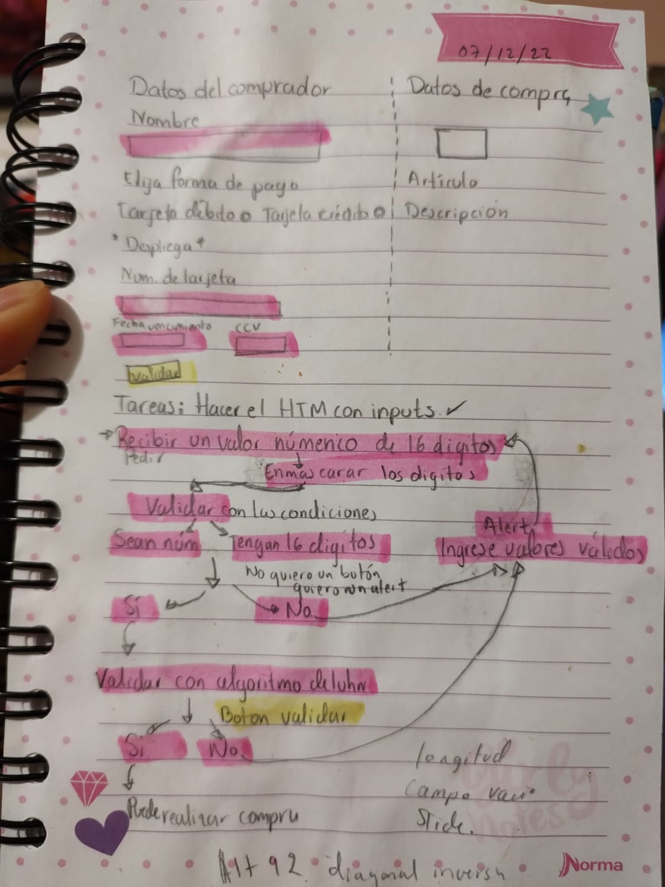
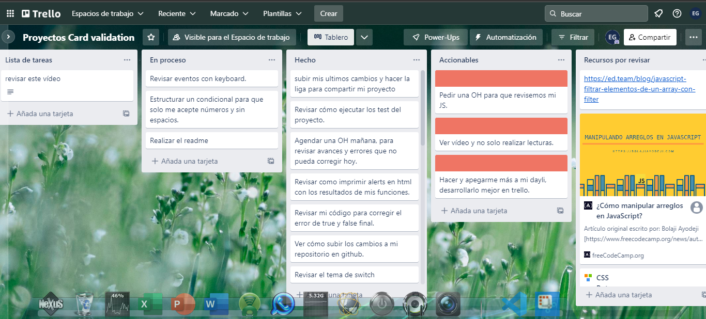

# Tarjeta de crédito válida

## Índice

* [1. Principales usuarios](#1-Principales-usuarios)
* [2. Objetivos](#2-objetivos)
* [3. Proceso de trabajo](#3-proceso-de-trabajo)

***

## 1. Principales usuarios

En este proyecto la página que se desarrollo fue para las usuarias de una marca de cósmeticos llamada "María Bonita". En esta interfaz los usuarios pueden validar un número de tarjeta para continuar con el proceso de compra en línea de los productos de la marca. 

## 2. Objetivos

El principal objetivo fue hacer una interfaz que le permitiera al usuario ingresar un número de tarjeta, que enmascarará dicho número y determinara si era una tarjeta válida para realizar la compra. 
Con esto los usuarios pueden realizar compras más efectivas, ya que los datos que ingresa son válidados; lo que podría indicarle al usuario si ha cometido algun error al ingresar sus datos y debe rectificarlo. 

## 3. Proceso de trabajo
* El proyecto comenzó con la elección del tema. Una vez que tuve claro el tema hice una busqueda de cómo se veían algunas páginas de tiendas en línea. Especificamente me centré en el ingreso y válidación de la tarjeta. De todas elegí la página de Bershka. 

* Cuando tuve claro qué tipo de diseño quería estuve documentandome acerca de posibles respuestas que me permitieran concretar el proyecto. Me di cuenta que debía comenzar por los conceptos básicos, así que en lugar de buscar respuestas comencé a estudiar. 

* Después de algunos días, consideré que me había documentado lo suficiente me dí cuenta de qué era necesario realizar un diagrama de flujo del proyecto. Esto me permitiría desarrollar un plan de trabajo: 

*Cuando tuve claras las actividades a realizar las plasme en Trello y fui trabajando con base en las actividades diarias que me proponía. Fue difícil aterrizar de forma puntual las actividades a realizar. 

*Considero que el mayo avancé de trabajo lo realicé en mi última semana de trabajo, ya que en ella se conjuntaron los aprendizajes de este primer proyecto.

Gracias

